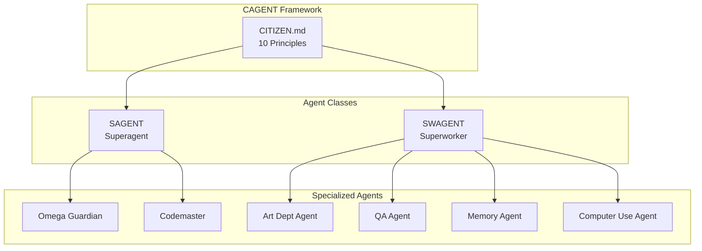
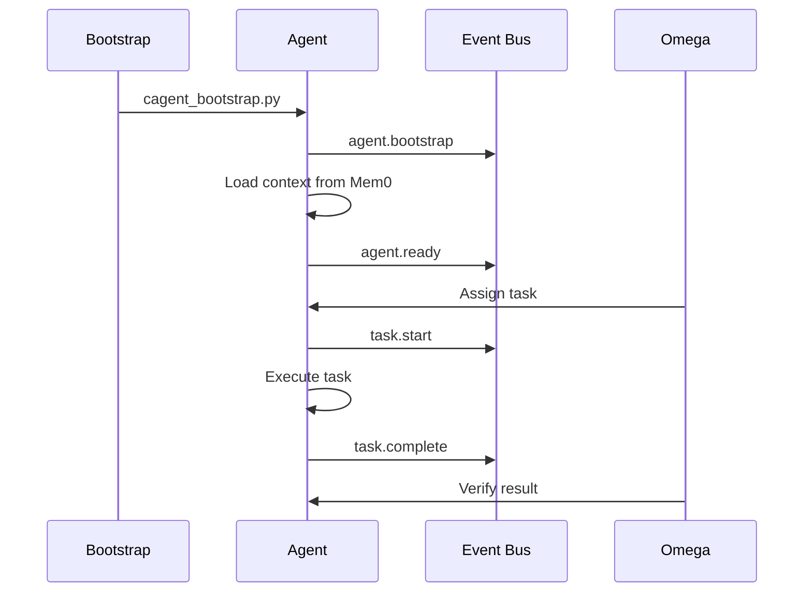

# Agents

**Protocol:** DKIN v28 / CAGENT v1 | **Status:** Active

---

This page introduces the agent roster, the contracts each agent follows, and the ownership lanes they hold. Use it to choose the right agent for a task and to see how they coordinate on the bus.

## Semantic Agent IDs (HOLON)

Agents should adopt semantically dense IDs to encode role, domain, and lineage.

Format:
```
<class>.<role>.<domain>.<focus>.<lane>.r<ring>.<model>.<variant>
```

Example:
```
sagent.planner.holon.header.dialogos.r0.claude-opus-4-5.ultrathink
```

**Note:** Model version dots MUST be normalized to hyphens (`4.5` -> `4-5`) to avoid
delimiter ambiguity. See spec for full validation rules.

Spec: `nucleus/specs/holon_semantic_naming_v1.md`

## Overview

Pluribus implements a multi-agent orchestration system with distinct agent types, each with specific capabilities and responsibilities.

## Agent Taxonomy



## Agent Types

### Superagents (SAGENT)

Full citizenship with orchestration capabilities:

| Agent | Purpose | Bus Prefix |
|-------|---------|------------|
| [Omega Guardian](omega-guardian.md) | System liveness verification | `omega.*` |
| [Codemaster](codemaster.md) | Git authority for critical branches | `codemaster.*` |

### Superworkers (SWAGENT)

Limited citizenship, task-specialized:

| Agent | Purpose | Bus Prefix |
|-------|---------|------------|
| [Art Dept](art-dept.md) | Generative art, diagrams | `art.*` |
| [QA Agent](qa-agent.md) | Testing, validation | `qa.*` |
| [Memory Agent](memory.md) | Context persistence | `memory.*` |
| [Computer Use](computer-use.md) | GUI automation | `cua.*` |

## Agent Lifecycle



## Bootstrap

```bash
# Bootstrap a superagent
python3 nucleus/tools/cagent_bootstrap.py --actor claude --class sagent

# Bootstrap a superworker
python3 nucleus/tools/cagent_bootstrap.py --actor codex --class swagent --scope "nucleus/tools/*"
```

## Codex CLI specifics (preferred)

- Launch via `/pluribus/nucleus/tools/bus-codex` to use the Codex HOME overlay and emit bus events.
- Shell snapshotting is enabled by default in `/pluribus/.pluribus/agent_homes/codex/.codex/config.toml`.
- Tip (Codex): "NEW! Try shell snapshotting to make your Codex faster. Enable in /experimental!"
- Verify with `codex features list` (expect `shell_snapshot` = true).

## 10 Core Principles (CITIZEN.md)

1. Append-Only Evidence
2. Non-Blocking IPC
3. Tests-First
4. No Secrets Emission
5. Conservation of Work
6. Replisome Compliance
7. Protocol Versioning
8. Deterministic Behavior
9. Self-Verification (VOR)
10. Graceful Degradation

## Related Documentation

- [CITIZEN Constitution](../protocols/citizen.md)
- [CAGENT Protocol](../protocols/cagent.md)
- [Agent Coordination Services](../deployment/services/agent.md)

---

*DKIN v28 Agent Framework*
